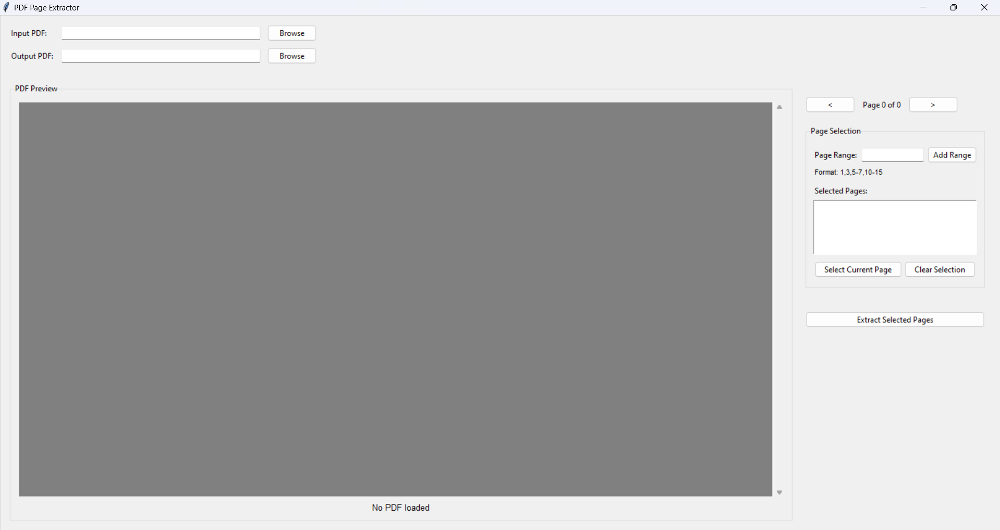

# PDF Page Extractor

A user-friendly desktop application for extracting pages from PDF files.



## Features

- Load any PDF file and browse through its pages
- Interactive page preview with zoom and scroll
- Select pages individually or specify page ranges
- Extract selected pages to a new PDF file
- Simple and intuitive user interface

## Installation

1. Clone this repository:

   ```
   git clone https://github.com/if12is/script_to_chunk_pdf_pages_and_export_it.git
   cd pdf-page-extractor
   ```

2. Create a virtual environment (optional but recommended):

   ```
   python -m venv venv
   source venv/bin/activate  # On Windows: venv\Scripts\activate
   ```

3. Install the required dependencies:
   ```
   pip install -r requirements.txt
   ```

## Usage

Run the application:

```
python main.py
```

### How to extract pages:

1. Click "Browse" to select an input PDF file
2. Navigate through the PDF using the "<" and ">" buttons
3. Select pages by either:
   - Clicking "Select Current Page" for the page you're viewing
   - Entering page ranges in the "Page Range" field (e.g., "1,3,5-7,10-15")
4. Specify an output file path
5. Click "Extract Selected Pages" to create a new PDF with only the selected pages

## Requirements

- Python 3.6+
- PyPDF2
- PyMuPDF (fitz)
- Pillow (PIL)
- tkinter (usually included with Python)

## License

This project is licensed under the MIT License - see the LICENSE file for details.
